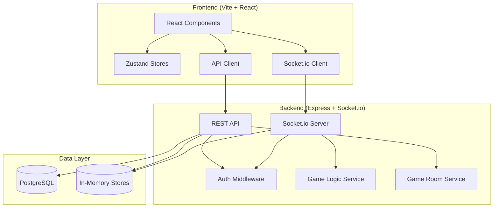

# Rummikub Pro

<div align="center">
  

**© 2024 LLC&JTH. All rights reserved.**
</div>

A full-featured Rummikub web application with real-time multiplayer, JWT authentication, custom game rooms, and WebSocket-driven gameplay.

---

## Project Overview

Rummikub Pro is a web-based implementation of the classic Rummikub tile game. Users can register, create or join game rooms, and play in real time with other players. The application uses a REST API for account management and room operations, and Socket.io for live game state updates, moves, and chat.

---

## Features

### Implemented

| Feature | Description |
|--------|-------------|
| **Authentication** | Register, login, logout; JWT tokens; profile update |
| **Game Rooms** | Create/join public or private rooms; invite codes; matchmaking |
| **Real-time Gameplay** | Full Rummikub rules; melds, runs, jokers; draw/place tiles; turn-based flow |
| **WebSocket Events** | Game state sync, moves, draw, end turn, chat |
| **Chat** | In-game chat via Socket.io |
| **Game Logic** | Shared TypeScript engine; set/board validation; win detection; scoring |
| **Frontend** | React + Vite; DnD Kit drag-and-drop tiles; responsive UI; theme toggle |
| **Database** | PostgreSQL (Drizzle ORM); users table with stats and coins |

### Roadmap (see [Future Roadmap](#future-roadmap))

---

## Architecture



---

## Tech Stack

| Layer | Technologies |
|-------|--------------|
| **Frontend** | React 18, TypeScript, Vite, Tailwind CSS, Zustand, Socket.io-client |
| **Backend** | Node.js, Express, Socket.io, TypeScript |
| **Database** | PostgreSQL (Drizzle ORM) |
| **Auth** | JWT, bcrypt |
| **Shared** | TypeScript types in `shared/` |

---

## Folder Structure

```
rummikub-app/
├── src/                    # Frontend (Vite app at root)
│   ├── api/                # API client, game API
│   ├── components/         # Game, Tile, dnd, ui components
│   ├── hooks/              # useSocket
│   ├── pages/              # Game, Rooms
│   ├── store/              # gameStore, userStore
│   └── utils/              # setValidation
├── backend/
│   ├── src/
│   │   ├── db/             # Drizzle schema, index
│   │   ├── middleware/     # auth
│   │   ├── routes/         # auth, rooms, game, partners, crypto, social
│   │   └── services/       # account, gameRoom, gameLogic, activeGameStore, etc.
│   ├── drizzle/            # SQL migrations
│   ├── Dockerfile
│   └── tsconfig.json
├── shared/                 # Shared types (imported as ../../../shared)
│   ├── types.ts
│   └── themeTypes.ts
├── docs/                   # Documentation
├── public/
├── DEPLOYMENT.md           # Build & deployment instructions
├── render.yaml             # Render Blueprint
├── fly.toml                # Fly.io config
├── railway.toml            # Railway config
├── .env.example
└── package.json
```

See [PROJECT_STRUCTURE.md](PROJECT_STRUCTURE.md) and [docs/PROJECT_STRUCTURE.md](docs/PROJECT_STRUCTURE.md) for detailed structure.

---

## Setup Instructions

### Prerequisites

- Node.js 18+
- PostgreSQL
- npm or yarn

### 1. Clone and install

```bash
git clone <repo-url>
cd rummikub-app
npm install
cd backend && npm install
```

### 2. Database

Create a PostgreSQL database and run migrations:

```bash
cd backend
npx drizzle-kit push
# or
npx drizzle-kit migrate
```

### 3. Environment variables

Copy and configure:

| File | Purpose |
|------|---------|
| `.env.example` → `.env` | Frontend build-time vars |
| `backend/.env.example` → `backend/.env` | Backend runtime vars |

See [Environment Variables](#environment-variables) below.

---

## Environment Variables

### Root (`.env`) — Frontend build-time

| Variable | Required | Description |
|----------|----------|-------------|
| `VITE_API_URL` | Yes (prod) | Backend API base URL (e.g. `https://api.example.com`) |
| `VITE_WS_URL` | Yes (prod) | WebSocket URL (e.g. `https://api.example.com`) |

### Backend (`backend/.env`)

| Variable | Required | Description |
|----------|----------|-------------|
| `NODE_ENV` | No | `development` or `production` |
| `PORT` | No | Server port (default `3000`) |
| `FRONTEND_URL` | Yes (prod) | Allowed CORS origin(s), comma-separated |
| `JWT_SECRET` | Yes | Secret for JWT (min 32 chars) |
| `DATABASE_URL` | Yes | PostgreSQL connection string |

---

## Running Locally

### Backend

From repo root (so `shared/` is available):

```bash
cd backend
npm run dev
```

Backend runs at `http://localhost:3000` (or `PORT`).

### Frontend

From repo root:

```bash
npm run dev
```

Frontend runs at `http://localhost:5173` (Vite default).

### Combined

- Backend: `http://localhost:3000`
- Frontend: `http://localhost:5173` (proxy to backend if configured)

Set `VITE_API_URL=http://localhost:3000` and `VITE_WS_URL=http://localhost:3000` in `.env` for local development.

---

## Build & Deployment

### Production build

- **Frontend:** From repo root: `npm ci && npm run build`. Output: `dist/`. Set `VITE_API_URL` and `VITE_WS_URL` before building.
- **Backend:** From repo root: `cd backend && npm ci && npm run build`. Start: `node backend/dist/server.js` (from repo root).

### Deployment

See **[DEPLOYMENT.md](DEPLOYMENT.md)** for:

- Environment variables (backend, frontend)
- CORS, logging, `/health` endpoint
- Deploy to Render, Railway, Fly.io
- Docker

---

## Future Roadmap

| Phase | Features |
|-------|----------|
| **Short-term** | Tournaments, AI opponents, extended stats persistence |
| **Medium-term** | Mobile apps (React Native/Capacitor), premium themes, achievements |
| **Long-term** | RUM Token (ERC-20), NFTs, marketplace, staking |

See [docs/future/architecture-vision.md](docs/future/architecture-vision.md) for architecture evolution.

---

## Documentation

| Document | Description |
|----------|-------------|
| [docs/API_REFERENCE.md](docs/API_REFERENCE.md) | REST API and WebSocket events |
| [docs/DATABASE_SCHEMA.md](docs/DATABASE_SCHEMA.md) | Database schema (users, etc.) |
| [docs/GAME_FLOW.md](docs/GAME_FLOW.md) | Game flow (rooms, turns, moves, scoring) |
| [docs/AUTH_FLOW.md](docs/AUTH_FLOW.md) | Authentication flow |
| [docs/PROJECT_STRUCTURE.md](docs/PROJECT_STRUCTURE.md) | Project structure |
| [DEPLOYMENT.md](DEPLOYMENT.md) | Build and deployment |

---

## License

Proprietary — All rights reserved
