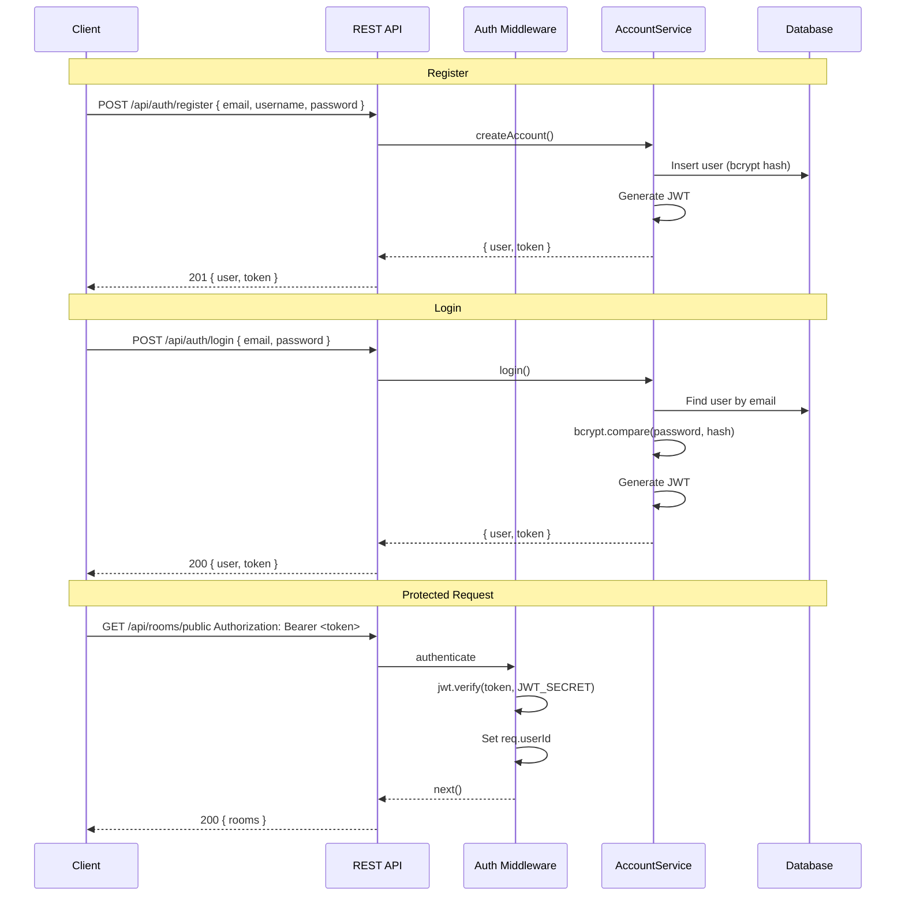

# Auth Flow

Authentication and authorization flow for Rummikub Pro.

---

## Overview

- **Mechanism:** JWT (JSON Web Token)
- **Password hashing:** bcrypt
- **Token transport:** `Authorization: Bearer <token>` for REST; `authenticate` event with `{ token }` for WebSocket

---

## Auth Flow Diagram



---

## REST Authentication

### Registration

**Endpoint:** `POST /api/auth/register`

**Body:**
```json
{
  "email": "user@example.com",
  "username": "player1",
  "password": "secret123"
}
```

**Validation:**
- `email`, `username`, `password` required
- Password min 6 characters
- Email and username must be unique

**Response (201):**
```json
{
  "success": true,
  "user": {
    "id": "...",
    "email": "user@example.com",
    "username": "player1",
    "level": 1,
    "coins": 100,
    "stats": { ... }
  },
  "token": "eyJhbGciOiJIUzI1NiIs..."
}
```

### Login

**Endpoint:** `POST /api/auth/login`

**Body:**
```json
{
  "email": "user@example.com",
  "password": "secret123"
}
```

**Response (200):**
```json
{
  "success": true,
  "user": { ... },
  "token": "eyJhbGciOiJIUzI1NiIs..."
}
```

### Protected Requests

Include the token in the header:

```
Authorization: Bearer <token>
```

Protected routes: `/api/auth/update`, `/api/auth/logout`, `/api/rooms/*`, `/api/game/:id`, `/api/partners/*`, `/api/crypto/*` (most).

---

## WebSocket Authentication

1. Client connects to Socket.io server.
2. Client emits `authenticate` with payload `{ token }`.
3. Server verifies JWT, stores `userId` in `socket.data`, joins `user:<userId>` room.
4. On failure, server emits `error` with `{ message }`.

```javascript
socket.emit('authenticate', { token: 'eyJhbGciOiJIUzI1NiIs...' });
```

Game events (`game-move`, `game-draw-tile`, `game-end-turn`) require prior `authenticate` so `socket.data.userId` is set.

---

## Auth Middleware

**File:** `backend/src/middleware/auth.ts`

- **`authenticate`:** Extracts `Authorization: Bearer <token>`, verifies JWT, sets `req.userId` and `req.user`.
- **`authorize(roles)`:** Checks `req.user.role` against allowed roles (used for admin-only routes like `POST /api/partners/create`).

---

## Token Format

- **Algorithm:** HS256
- **Payload:** `{ userId: string }`
- **Expiry:** Set in `accountService.generateToken()` (typically 7 days or as configured)
- **Secret:** `JWT_SECRET` from `backend/.env` (min 32 chars recommended)

---

## Logout

**Endpoint:** `POST /api/auth/logout` (requires auth)

Server responds `{ success: true }`. Client must discard the stored token; JWT is stateless, so server does not invalidate it. For token revocation, a blacklist or short-lived tokens would be needed in the future.

---

## Profile Update

**Endpoint:** `PATCH /api/auth/update` (requires auth)

**Body:**
```json
{
  "username": "newUsername",
  "avatar": "https://...",
  "bio": "About me"
}
```

All fields optional. Username must remain unique.
