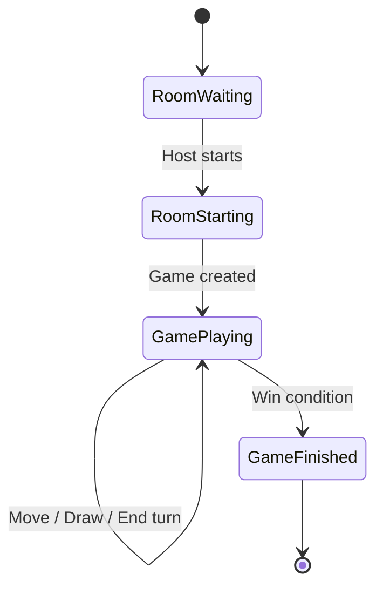

# Game Flow

Documentation of the Rummikub game flow: rooms, matchmaking, game start, turns, moves, and scoring.

---

## Overview

---

## 1. Room Lifecycle

### Create Room

1. Client calls `POST /api/rooms` with `{ name?, settings?, isPrivate?, password? }`.
2. Server creates a room in `GameRoomService` and returns `room` (id, inviteCode, inviteLink, etc.).
3. Host joins Socket room via `join-room` with `roomId`.

### Join Room

1. Client calls `POST /api/rooms/join` with `{ inviteCode, password? }`.
2. Server validates code/password, adds player to room, emits `player-joined` to room via Socket.io.
3. Joining client emits `join-room` with `roomId` to subscribe to updates.

### Leave Room

1. Client calls `POST /api/rooms/:id/leave`.
2. Server removes player from room and emits `player-left` (or equivalent) to room.

### Matchmaking

1. Client calls `POST /api/rooms/matchmaking` with `{ gameMode?, maxPlayers? }`.
2. Server finds an existing public room or creates one, adds the player, and returns the room.

---

## 2. Game Start

1. Host calls `POST /api/rooms/:id/start`.
2. Server checks host, creates a `Game` via `gameRoomService.startGame()`:
   - Creates deck (106 tiles: 2×(1–13)×4 colors + 2 jokers).
   - Deals tiles per `initialTiles` (default 14).
   - Sets `currentPlayerIndex = 0`.
   - Stores game in `activeGameStore`.
3. Server returns `{ game }` and emits game state to room via Socket.io.
4. Players emit `join-game` with `gameId` to receive `game-state` and subsequent updates.

---

## 3. Turn Flow

### Turn Order

- `game.currentPlayerIndex` indicates whose turn it is.
- Turns advance clockwise (index increments, wraps on last player).

### During a Turn

A player can:

1. **Place melds** — Send `game-move` with `{ type: 'meld', sets }`.
2. **Manipulate board** — Send `game-move` with `{ type: 'manipulate', sets }`.
3. **Draw tile** — Send `game-draw-tile` with `{ gameId }`.
4. **End turn** — Send `game-end-turn` with `{ gameId }`.

### First Meld Rule

- Until a player has made an initial meld (sum ≥ 30, configurable via `minInitialScore`), they cannot place tiles on existing sets.
- `Player.hasMadeInitialMeld` tracks this.

---

## 4. Move Types and Validation

### Move Types

| Type | Description |
|------|-------------|
| `meld` | Place new sets on board; must be valid runs or groups. |
| `manipulate` | Add to or rearrange existing sets; board must stay valid. |
| `draw` | Draw one tile from pool; turn ends. |
| `end_turn` | End turn without placing; turn ends. |

### Set Validation

- **Run:** Same color, consecutive values (1–13); jokers fill gaps.
- **Group:** Same value, different colors; max 4 tiles; jokers allowed.
- Minimum 3 tiles per set.
- No duplicate tile IDs on board.

Validation logic lives in `backend/src/services/gameLogicService.ts` (`validateSet`, `validateBoard`, `validateMove`).

---

## 5. Win Condition and Scoring

### Win

- A player wins when their hand is empty after placing tiles.
- `gameLogicService.checkWin(player)` returns true when `player.tiles.length === 0`.

### Scoring (End of Game)

- Winner gets positive score; losers get negative (sum of tile values in hand).
- Jokers in hand count as 30 points penalty.
- `gameLogicService.computeScores(game, winnerIndex)` returns scores per player.
- Server emits `game-finished` with `{ game, scores }`.

---

## 6. Real-time Updates

| Event | Direction | Purpose |
|-------|-----------|---------|
| `game-state` | Server → Client | Full game state after any change |
| `turn-changed` | Server → Client | `currentPlayerIndex` updated |
| `game-finished` | Server → Client | Game over; `scores` included |
| `chat-message` | Bidirectional | In-game chat messages |

---

## 7. Data Structures (shared/types.ts)

- **Game:** `id`, `players`, `currentPlayerIndex`, `pool`, `board`, `gameMode`, `status`, `winnerId`, `startedAt`, `endedAt`.
- **Player:** `id`, `userId`, `name`, `avatar`, `tiles`, `score`, `hasMadeInitialMeld`.
- **GameSet:** `id`, `tiles`, `type` (`'run' | 'group'`).
- **Tile:** `id`, `value`, `color`, `isJoker`.

---

## 8. Game Logic Location

| Component | Location |
|-----------|----------|
| Deck creation | `gameLogicService.createDeck()` |
| Dealing | `gameLogicService.deal()` |
| Set validation | `gameLogicService.validateSet()` |
| Board validation | `gameLogicService.validateBoard()` |
| Move validation | `gameLogicService.validateMove()` |
| Win check | `gameLogicService.checkWin()` |
| Score computation | `gameLogicService.computeScores()` |
