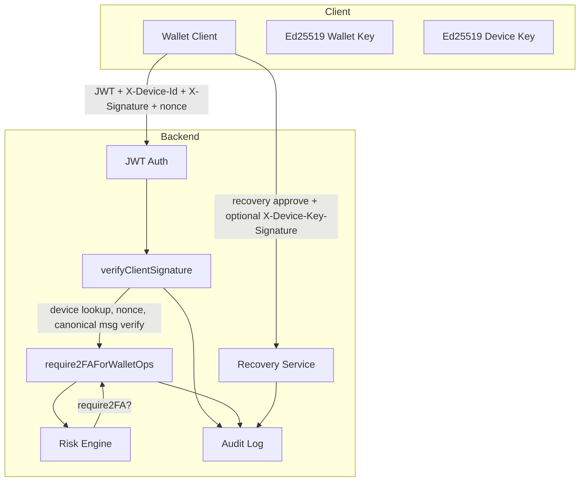

# Rumi Wallet Security Whitepaper

**Document Version:** 1.0  
**Scope:** Steps Security.1 through Security.10 (Phase 1 + Phase 2)  
**Classification:** Internal / Partner / Audit

---

## 1. Executive Summary

### 1.1 Purpose of the Document

This document describes the security architecture, threat model, and guarantees of the Rumi Wallet backend as implemented through Security Steps 1–10 (Phase 1 and Phase 2). It is intended for security auditors, institutional partners, legal teams, investors, and internal engineering. All statements are tied to concrete implementation (code paths, schemas, and configuration).

### 1.2 Threat Model Overview

The system is designed to mitigate:

- **Session theft:** Binding of sessions to devices and optional device-key proof.
- **Replay attacks:** Per-device nonces and timestamp freshness on signed operations.
- **Recovery hijacking:** HMAC-secured tokens, device-key verification, and recent 2FA on approval.
- **High-risk operation fraud:** Risk-based 2FA and audit logging of high-risk decisions.
- **Multi-device impersonation:** Rejection when session device and request device differ (DEVICE_SESSION_MISMATCH).

Threats explicitly **out of scope** include: compromise of the user’s seed phrase, compromise of the device’s Ed25519 private key, social engineering outside the application, and full OS compromise.

### 1.3 High-Level Guarantees

- **Wallet operations** (spend, transfer, simulate-payment) require a valid JWT, a registered and non-revoked device, a client-side Ed25519 signature over a canonical message, and a per-device nonce that has not been used.
- **Session–device binding:** When the session carries a device identifier, requests with a different `X-Device-Id` are rejected (403 DEVICE_SESSION_MISMATCH).
- **Recovery:** Approval links use HMAC-SHA256–secured tokens; approval may require device-key signature and recent 2FA when configured.
- **High-risk flows:** A configurable risk engine can require 2FA for operations that exceed a score threshold; these decisions are audited.

### 1.4 Explicit Boundaries (What Rumi Wallet Does NOT Guarantee)

- **Seed compromise:** If the user’s recovery seed is exposed, the system cannot prevent its misuse.
- **Device private-key compromise:** If the device’s Ed25519 private key (wallet or device_key) is stolen, the system cannot distinguish the legitimate device from the attacker.
- **JWT issuance and lifetime:** Security of login and JWT issuance is outside the scope of this document; the wallet layer assumes a valid JWT and optional session device binding.
- **Network and transport:** TLS and certificate validation are assumed; this document does not specify transport security.
- **Email and SMS delivery:** Recovery and OTP delivery depend on third-party channels; forgery or interception is out of scope of the wallet backend’s guarantees.
- **Insider and DB compromise:** A full database or backend compromise is out of scope; design focuses on client/server and recovery abuse resistance.

---

## 2. Security Architecture Overview

### 2.1 Identity Model

| Identifier    | Source / Storage | Purpose |
|---------------|------------------|---------|
| **userId**    | JWT `userId` (or equivalent); primary key in `users` | Account identity. |
| **publicKey** | `user_security.public_key` (Ed25519, base64 or PEM) | Verification of wallet-operation signatures (spend, transfer, simulate-payment). |
| **deviceId**  | Client-generated; `X-Device-Id` header; stored in `user_devices.device_id` | Device instance; unique per user via `(user_id, device_id)`. |
| **deviceKey** | Optional; `user_devices.device_key` (Ed25519 public, base64) | Verification of device-auth signatures (e.g. recovery approval). |

### 2.2 Trust Anchors

- **Ed25519 user signature:** Wallet operations are signed with the user’s registered public key over a canonical message (domain, chainId, operation, userId, timestamp, nonce, deviceId, sessionId, payload).
- **Ed25519 device signature:** When a device has a `device_key`, recovery approval can require a signature over a device-auth message (domain, type, userId, deviceId, sessionId, timestamp).
- **2FA:** TOTP, email OTP, or SMS OTP; used when 2FA is enabled and when the risk engine requires it for wallet or recovery flows.
- **Sessions:** JWT plus optional `deviceId` in the token or supplied at login; used to enforce session–device binding.

### 2.3 Domain Separation

- **RUMI_WALLET_V1:** Canonical message domain for wallet operations. Configurable via `SECURITY_DOMAIN` (default: `RUMI_WALLET_V1`).
- **RUMI_WALLET_DEVICE_V1:** Fixed domain for device-auth messages (device-key signing). Not configurable in the current implementation.
- **chainId:** Environment indicator in the canonical message. Configurable via `SECURITY_CHAIN_ID`; typical values: `prod`, `dev`, `staging`. Defaults to `prod` when `NODE_ENV === 'production'`, else `dev`.

### 2.4 Architecture Diagram



---

## 3. Cryptographic Foundations

### 3.1 Ed25519 for User-Level Signatures

- **Algorithm:** Ed25519 (signature length 64 bytes).
- **Library:** Node.js `crypto.verify` for PEM keys; `@noble/ed25519` for raw 32-byte public keys.
- **Public key storage:** `user_security.public_key`. Accepted formats: PEM or base64-encoded 32-byte raw public key.
- **Usage:** The client signs the canonical wallet message (UTF-8); the server verifies using the stored public key. Signature is sent as base64 in `X-Signature`.

### 3.2 Ed25519 for Device-Level Signatures

- **Algorithm:** Ed25519 (same as user-level).
- **Storage:** `user_devices.device_key` (optional; base64 or PEM).
- **Usage:** For recovery approval, when the device has a `device_key`, the client signs the device-auth message; the server verifies with `device_key`. Signature is sent in `X-Device-Key-Signature`; timestamp in `X-Device-Auth-Timestamp` (optional; default server time).

### 3.3 Deterministic Canonical Messages

Canonical messages are JSON objects with **alphabetically sorted keys** (recursively for nested objects) and no extra whitespace, so the same logical content always produces the same string.

**Wallet canonical message** is built from:

- `chainId` — from config (`SECURITY_CHAIN_ID`).
- `deviceId` — from `X-Device-Id`.
- `domain` — from config (`SECURITY_DOMAIN`, default `RUMI_WALLET_V1`).
- `nonce` — from `X-Signature-Nonce`.
- `operation` — `spend` \| `transfer` \| `simulate-payment`.
- `payload` — request body, keys sorted recursively.
- `sessionId` — from JWT/session (e.g. `sessionId` or `jti`); may be empty.
- `timestamp` — from `X-Signature-Timestamp` (Unix ms).
- `type` — literal `wallet-operation`.
- `userId` — from JWT.

The entire top-level object is key-sorted before `JSON.stringify`. Implementation: `buildCanonicalMessage(operation, userId, timestamp, nonce, deviceId, sessionId, payload)` in `canonicalMessage.ts`.

### 3.4 Domain Separation

- Wallet operations use `domain` and `chainId` from configuration so that signatures are bound to a specific application and environment (e.g. prod vs dev).
- Device-auth messages use the fixed domain `RUMI_WALLET_DEVICE_V1` and type `device-auth`, so they cannot be confused with wallet-operation messages.

### 3.5 HMAC-Secured Recovery Tokens

- **Format:** `token = base64url(random_32 || HMAC-SHA256(secret, random_32)[0:16])`.
- **Constants:** 32 bytes random, 16 bytes MAC; total 48 bytes before encoding.
- **Secret:** `RECOVERY_TOKEN_SECRET` (must be set in production).
- **Storage:** Only the 32-byte random value is stored (as hex in `recovery_tickets.approval_token`). The MAC is not stored.
- **Validation:** Decode base64url → split random \|\| mac → recompute MAC with constant-time compare (`crypto.timingSafeEqual`). On mismatch, return null without DB lookup to avoid oracle leakage.
- **Implementation:** `recoveryToken.ts` (`generateRecoveryToken`, `validateRecoveryToken`).

### 3.6 Nonce Model (Per-Device Replay Protection)

- **Storage:** `user_devices.last_nonce` (one nonce per device). `user_security.last_nonce` is deprecated and no longer used for replay checks.
- **Logic:** For each wallet operation, after signature verification the server runs an atomic update:
  - `UPDATE user_devices SET last_nonce = $incomingNonce, last_seen_at = NOW() WHERE user_id = $userId AND device_id = $deviceId AND (last_nonce IS NULL OR last_nonce != $incomingNonce)`.
- **Replay:** If zero rows are updated, the nonce was already used → response 400 with code `REPLAY_DETECTED`.
- **Ordering:** Nonce update is performed only after successful Ed25519 verification.

---

## 4. Device Identity & Session Binding

### 4.1 user_devices Schema

| Column       | Type         | Description |
|-------------|--------------|-------------|
| id          | TEXT PK      | UUID. |
| user_id     | TEXT NOT NULL| FK to users; ON DELETE CASCADE. |
| device_id   | TEXT NOT NULL| Client-defined device identifier. |
| device_name | TEXT         | Optional display name. |
| created_at  | TIMESTAMPTZ  | Default NOW(). |
| last_seen_at| TIMESTAMPTZ  | Updated on signature verification and recovery. |
| is_trusted  | BOOLEAN      | Default false; used by risk engine. |
| metadata    | JSONB        | Optional; may hold recovered, assistedRecovery, recoveryOpsCount, lastSeenIp. |
| revoked_at  | TIMESTAMPTZ  | If set, device is revoked. |
| last_nonce  | TEXT         | Last accepted nonce for this device. |
| device_key  | TEXT         | Optional Ed25519 public key (base64) for device-auth. |

**Unique constraint:** `(user_id, device_id)`.

Devices are created via `POST /api/security/device/register` (authenticated). Wallet operations that require signature verification do **not** auto-register devices; unknown devices receive 400 `DEVICE_NOT_FOUND`.

### 4.2 device_key (Ed25519 Public Key per Device)

- **Optional:** Registration and wallet flows do not require `device_key`.
- **Registration:** `POST /api/security/device/register` body may include `deviceKey`; if the device exists and `deviceKey` differs from stored, it is updated.
- **Usage:** When a device has `device_key`, recovery approval can require a valid `X-Device-Key-Signature` over the device-auth message; invalid or missing signature yields 403 and audit event `DEVICE_KEY_INVALID`.

### 4.3 Session ↔ Device Binding

- **At auth:** If the JWT does not contain a device identifier, the middleware may set `req.user.deviceId` from the `X-Device-Id` header when present (implementation: `auth.ts`).
- **At wallet ops:** Middleware `verifyClientSignature` reads `req.user.deviceId` (session device) and compares it to `X-Device-Id` (request device).

### 4.4 DEVICE_SESSION_MISMATCH Enforcement

- **Condition:** `req.user.deviceId` is set and not equal to the request’s `X-Device-Id`.
- **Response:** HTTP 403, body code `DEVICE_SESSION_MISMATCH`, message "Session bound to different device".
- **Audit:** Event `DEVICE_SESSION_MISMATCH` with metadata `{ sessionDeviceId, headerDeviceId }`.
- **Implementation:** `verifyClientSignature.ts` (before signature verification).

### 4.5 Device Revocation Model

- **Storage:** `user_devices.revoked_at`. When non-null, the device is revoked.
- **Enforcement:** In `verifyClientSignature`, after device lookup, if `device.revokedAt` is set the request is rejected with HTTP 403 and code `DEVICE_REVOKED`.
- **Audit:** The event type `DEVICE_REVOKED` is defined for use when a revocation action is implemented (e.g. device revoke endpoint); the current code path that rejects revoked devices does not log this event (it only returns the error code).

### 4.6 Device Metadata (recovered, assistedRecovery, trusted)

- **recovered / assistedRecovery:** Set in device `metadata` when recovery is approved or finalized; used by the risk engine as `isRecovered`.
- **is_trusted:** Boolean column; reduces risk (trusted device, low amount, backed-up seed can yield `require2FA = false`).
- **recoveryOpsCount:** Can be stored in metadata for “first N ops after recovery” scoring (risk factor RECENT_RECOVERY).
- **lastSeenIp:** Can be stored in metadata for IP-change detection (risk factor IP_CHANGE); implementation supports it when present.

---

## 5. Authentication & Authorization Layers

### 5.1 Multi-Factor Authentication (TOTP, Email, SMS)

- **TOTP:** TOTP secret stored encrypted (AES-256-GCM) in `user_security.totp_secret`; issuer "Rumi Wallet". Enable/verify via security controller.
- **Email OTP:** OTP stored in Redis (or equivalent) with configurable TTL (`OTP_TTL`, default 120 s); verified against user’s email.
- **SMS OTP:** Same pattern for phone number; delivery and storage TTL configurable.
- **Methods:** `user_security.two_factor_methods` array (`totp` \| `email_otp` \| `sms_otp`). When `two_factor_enabled` is true, wallet operations that trigger the risk engine’s 2FA requirement must present a valid code via `X-2FA-Code`, `X-Email-OTP`, or `X-SMS-OTP`; verification is via `verify2FACode`.

### 5.2 Risk-Based 2FA Engine

- **Entry point:** Middleware `require2FAForWalletOps(operation)` (used for spend, transfer, simulate-payment).
- **Inputs (RiskContext):** userId, device row, IP (optional), operation, amount (optional), hasBackedUpSeed, isRecovered, recoveryOpsCount, isTrusted.
- **Output:** `{ score, require2FA, factors }`. `require2FA = (score >= RISK_THRESHOLD_2FA_REQUIRED)` (default threshold 3).

### 5.3 High-Risk Operation Classification

Risk factors and weights (configurable via env where noted):

| Factor             | Weight | Condition |
|--------------------|--------|-----------|
| NEW_DEVICE         | 2      | Device age < RISK_NEW_DEVICE_DAYS (default 7). |
| RECOVERED_DEVICE   | 2      | Device metadata indicates recovered/assistedRecovery. |
| RECENT_RECOVERY    | 3      | Recovered and recoveryOpsCount < RISK_RECOVERY_FIRST_N_OPS (default 5). |
| IP_CHANGE          | 1      | Current IP differs from metadata.lastSeenIp (when both present). |
| HIGH_AMOUNT        | 2      | amount > RISK_HIGH_AMOUNT_THRESHOLD (default 10_000). |
| SEED_NOT_BACKED_UP | 2      | !user_security.seed_backed_up. |

When `require2FA` is true, the middleware logs `HIGH_RISK_OPERATION` and requires a valid 2FA code before proceeding.

### 5.4 Assisted Recovery Approval Hardening

Recovery approval flow (`GET /api/security/recovery/approve?token=...`):

1. **Auth:** JWT required; `userId` must match ticket’s `userId`.
2. **Headers:** `X-Device-Id` required; optional `X-Device-Key-Signature`, `X-Device-Auth-Timestamp`; optional 2FA headers.
3. **Token:** HMAC validation; on failure, return generic error and do not hit DB for token lookup.
4. **Ticket:** Lookup by stored random (approval_token); validate status PENDING, not expired, deviceId matches.
5. **Device:** Device must exist for (userId, deviceId). If device has `device_key`, require `X-Device-Key-Signature`; build device-auth message (userId, deviceId, sessionId, timestamp); verify with device_key. On failure: 403, `DEVICE_KEY_INVALID`, audit `DEVICE_KEY_INVALID`. On success: audit `DEVICE_KEY_VERIFIED`.
6. **2FA:** If user has 2FA enabled, require valid 2FA code; otherwise return 403 with `require2FA: true`.
7. **Completion:** Mark ticket USED, upsert device metadata (recovered, assistedRecovery), audit `RECOVERY_APPROVED_HARDENED` with `{ ticketId, deviceId, hasDeviceKey }`.

### 5.5 Session Integrity Guarantees

- Session is bound to a device when `req.user.deviceId` is set; requests from another device are rejected with DEVICE_SESSION_MISMATCH.
- JWT issuance and refresh are outside this document; the wallet assumes the session is valid and optionally device-bound.

---

## 6. Recovery Architecture

### 6.1 Seed Backup Confirmation

- **Storage:** `user_security.seed_backed_up` (boolean, default false).
- **Purpose:** Informs risk engine; when false, factor SEED_NOT_BACKED_UP adds 2 to the risk score. Setting this flag is application-specific (e.g. after user confirms backup in UI).

### 6.2 Seed Recovery (Sovereign)

Sovereign recovery (user restores from their own backup without server-assisted flow) is not implemented in the backend; the server does not store or handle seed material. This whitepaper covers only **assisted** recovery.

### 6.3 Assisted Recovery (Phase 1 + Phase 2)

- **Request:** Client calls `POST /api/security/recovery/request` with body `{ email }` and header `X-Device-Id` (no auth). Server finds user by email; if found, creates a recovery ticket and generates an HMAC-secured token; the link (with token) is intended for email delivery (implementation may log it in dev).
- **Approval:** User opens link; client calls `GET /api/security/recovery/approve?token=...` with auth, `X-Device-Id`, and optionally device-key signature and 2FA (see §5.4).
- **Finalize:** Client calls `POST /api/security/recovery/finalize` with auth, body `ticketId`, and `X-Device-Id` (or body `deviceId`); server validates ticket status USED and device match, then upserts device metadata (recovered, assistedRecovery).

### 6.4 Recovery Tickets

**Schema recovery_tickets:**

| Column          | Type         | Description |
|-----------------|--------------|-------------|
| id              | TEXT PK      | UUID. |
| user_id         | TEXT NOT NULL| FK users. |
| device_id       | TEXT         | Target device for recovery. |
| created_at      | TIMESTAMPTZ  | Default NOW(). |
| expires_at      | TIMESTAMPTZ  | Set at creation (e.g. TTL 900 s). |
| used_at         | TIMESTAMPTZ  | Set when approved. |
| status          | TEXT         | PENDING \| USED \| EXPIRED \| CANCELLED. |
| method          | TEXT         | ASSISTED. |
| metadata        | JSONB        | Optional. |
| approval_token  | TEXT UNIQUE  | Stored random (hex); not the full token. |

### 6.5 HMAC Token Integrity

See §3.5. Token is sent in the approval link; server validates MAC before any DB lookup by approval_token, preventing token-oracle attacks.

### 6.6 Recovery Approval with deviceKey + Recent 2FA

- When `device_key` is present, approval requires a valid Ed25519 signature over the device-auth message (userId, deviceId, sessionId, timestamp).
- When the user has 2FA enabled, approval requires a valid 2FA code (TOTP or OTP). The specification of “2FA within last 5 minutes” is implemented by requiring 2FA at approval time rather than tracking a separate “last 2FA” timestamp.

### 6.7 Abuse Throttling and Rate Limits

- **Per-user:** Count of recovery tickets in the last 24 hours with status ≠ CANCELLED. If count ≥ `RECOVERY_MAX_TICKETS_PER_24H` (default 3), request returns 429 `RECOVERY_LIMIT_REACHED` and `user_security.recovery_abuse_flag` is set to true.
- **No per-email disclosure:** For unknown email, the API returns success without creating a ticket (no user enumeration).

### 6.8 Recovery Cleanup Job

- **Schedule:** Hourly (cron `0 * * * *`).
- **Actions:**  
  1) Update tickets with status PENDING and `expires_at < now()` to status EXPIRED.  
  2) Delete tickets with `created_at` older than 30 days.
- **Implementation:** `recoveryCleanupJob.ts` (`runRecoveryCleanup`).

---

## 7. Replay Protection & Anti-Fraud Controls

### 7.1 Per-Device Nonce

See §3.6. Each device has a single `last_nonce`; reuse is rejected with REPLAY_DETECTED.

### 7.2 Timestamp Freshness

- **Header:** `X-Signature-Timestamp` (Unix milliseconds).
- **Check:** `|now - timestamp| <= signatureMaxAgeMs` (default 60_000 ms). Violation → 400 `SIGNATURE_EXPIRED`.
- **Config:** `SIGNATURE_MAX_AGE_MS`.

### 7.3 Canonical Message Immutability

The signed message includes domain, chainId, operation, userId, timestamp, nonce, deviceId, sessionId, and payload. Any change invalidates the signature. Keys are sorted so the server and client build the same string.

### 7.4 Device-Key Signature for High-Risk Flows

Recovery approval is the primary flow that requires (when device_key is set) a device-key signature, binding the approval to the device’s key and reducing approval hijacking risk.

### 7.5 Risk Engine Scoring Model

See §5.3. Score is the sum of factor weights; threshold for requiring 2FA is configurable (default 3). Factors are logged in HIGH_RISK_OPERATION and can support anomaly detection.

### 7.6 Audit Log Integration

High-risk decisions (require2FA = true) trigger an audit event before 2FA is demanded; signature verification and device/session mismatch also emit audit events (see §8).

---

## 8. Audit Logging & Observability

### 8.1 audit_log Schema

| Column     | Type        | Description |
|------------|-------------|-------------|
| id         | TEXT PK     | UUID. |
| user_id    | TEXT        | Nullable. |
| device_id  | TEXT        | Nullable. |
| event_type | TEXT NOT NULL | Event identifier. |
| metadata   | JSONB       | Optional event payload. |
| created_at | TIMESTAMPTZ | Default NOW(). |

**Indexes:** user_id, event_type, created_at (per migration 0019).

### 8.2 Event Types

| Event Type                 | When Emitted |
|---------------------------|--------------|
| SIGNATURE_VERIFIED        | After successful wallet-operation signature and nonce acceptance. |
| DEVICE_REGISTERED         | On device create or update via /device/register. |
| DEVICE_REVOKED            | Reserved for device revocation action. |
| DEVICE_SESSION_MISMATCH   | Session deviceId ≠ X-Device-Id on wallet op. |
| DEVICE_KEY_VERIFIED       | Recovery approval with valid device-key signature. |
| DEVICE_KEY_INVALID        | Recovery approval with device_key set but missing or invalid signature. |
| RECOVERY_REQUEST          | Recovery ticket created (after throttle check). |
| RECOVERY_APPROVED         | Legacy/alternate path; primary path uses RECOVERY_APPROVED_HARDENED. |
| RECOVERY_APPROVED_HARDENED| Recovery approval completed (token, device, optional deviceKey, 2FA). |
| RECOVERY_FINALIZED        | Finalize recovery called successfully. |
| HIGH_RISK_OPERATION       | Risk engine set require2FA = true; metadata includes score, factors, operation, amount. |
| RISK_EVALUATED            | Reserved for optional logging of every risk evaluation. |

### 8.3 Forensic Analysis

- **Correlation:** user_id, device_id, and created_at allow ordering and grouping by user or device.
- **Recovery:** RECOVERY_REQUEST, RECOVERY_APPROVED_HARDENED, RECOVERY_FINALIZED and optional DEVICE_KEY_VERIFIED/DEVICE_KEY_INVALID give a full approval trail.
- **Replay and misuse:** SIGNATURE_VERIFIED plus REPLAY_DETECTED (response code; can be inferred from absence of SIGNATURE_VERIFIED after a nonce reuse) and DEVICE_SESSION_MISMATCH support replay and device-misuse analysis.

### 8.4 Anomaly Detection

- **Volume:** Counts of RECOVERY_REQUEST, RECOVERY_APPROVED_HARDENED, DEVICE_KEY_INVALID per user/device/time window.
- **Risk:** HIGH_RISK_OPERATION metadata (score, factors) and RISK_EVALUATED (if enabled) for trend analysis.
- **Mismatch:** DEVICE_SESSION_MISMATCH rate per user or IP.

### 8.5 Retention and Cleanup Strategy

- **audit_log:** No automatic purge is implemented in the described steps; retention is operational policy.
- **recovery_tickets:** Expired PENDING tickets are marked EXPIRED; tickets older than 30 days are deleted by the hourly job (§6.8).

---

## 9. Threat Model

### 9.1 Attacker Capabilities Considered

- **Network:** Can observe and replay HTTP(S) traffic if not mitigated by TLS and application-level replay controls.
- **Stolen session:** Has a valid JWT (and possibly session deviceId).
- **Multiple devices:** Can register devices and attempt to use one session from another device.
- **Recovery link:** May obtain the recovery link (e.g. email compromise or phishing).
- **Guessing:** Cannot guess HMAC secret or Ed25519 private keys; can attempt brute force on OTPs within TTL and rate limits.

### 9.2 Attacks Mitigated

| Attack | Mitigation |
|--------|------------|
| **Session theft** | Session–device binding (DEVICE_SESSION_MISMATCH); optional device_key proof on recovery. |
| **Device spoofing** | Device must be registered; revocation enforced; optional device_key signature. |
| **Replay attacks** | Per-device nonce; timestamp freshness; single-use recovery tokens. |
| **Token tampering** | HMAC on recovery token; invalid MAC returns null without DB lookup. |
| **Recovery hijacking** | Token bound to ticket; deviceId match; optional device_key + 2FA at approval. |
| **High-risk operation fraud** | Risk-based 2FA and HIGH_RISK_OPERATION audit. |
| **Multi-device impersonation** | Session deviceId must match X-Device-Id. |

### 9.3 Attacks Out of Scope

- **Compromised user seed:** Attacker can derive keys and sign; server cannot distinguish.
- **Compromised device private key:** Same as above for wallet or device_key.
- **Social engineering outside the app:** e.g. user giving OTP or password to attacker.
- **OS-level compromise:** Keyloggers, memory scraping, etc.
- **Full backend or DB compromise:** Design does not assume compromise of secrets or data at rest.

---

## 10. Security Guarantees

### 10.1 What the System Guarantees

- **Wallet operations** are accepted only with a valid JWT, a known non-revoked device, a correct Ed25519 signature over the canonical message, a fresh timestamp, and a new per-device nonce.
- **Session–device binding:** If the session has a deviceId, requests with a different X-Device-Id are rejected and audited.
- **Recovery tokens** cannot be forged without RECOVERY_TOKEN_SECRET; validation is constant-time and does not leak validity via DB.
- **Recovery approval** can require device-key proof and 2FA when configured; completion is audited with RECOVERY_APPROVED_HARDENED.
- **High-risk operations** can be gated by 2FA when the risk score meets the threshold; the decision is audited.

### 10.2 What the System Does Not Guarantee

- Integrity of the user’s seed or device private keys.
- Security of JWT issuance, refresh, or storage on the client.
- Delivery or secrecy of email/SMS used for OTP or recovery links.
- Protection against insider or full DB/backend compromise.
- Protection when RECOVERY_TOKEN_SECRET, JWT_SECRET, or encryption keys are weak or exposed.

### 10.3 Conditions Under Which Guarantees Degrade

- **Weak or default secrets:** Production must set RECOVERY_TOKEN_SECRET, JWT_SECRET, and SECURITY_ENCRYPTION_KEY appropriately.
- **No device_key:** Recovery approval does not cryptographically bind to the device key if device_key is not set.
- **Empty sessionId:** Canonical message may have empty sessionId if JWT does not carry it; binding is then only by deviceId.
- **Clock skew:** Large client/server clock skew can cause valid timestamps to be rejected (signature expired).

### 10.4 Future Hardening Opportunities (Phase 3)

- **Mandatory device_key:** Require device_key for wallet operations or recovery.
- **Strict session binding:** Require deviceId and sessionId in JWT and reject empty sessionId for wallet ops.
- **Last 2FA timestamp:** Store and enforce “2FA within last N minutes” for recovery and high-risk ops.
- **Audit retention policy:** Automated retention and archival for audit_log.
- **RISK_EVALUATED logging:** Log every risk evaluation for full audit trail.

---

## 11. Appendix

### 11.1 Full Canonical Message Example (Wallet)

Config: domain = RUMI_WALLET_V1, chainId = prod. After key sorting (alphabetical):

```json
{
  "chainId": "prod",
  "deviceId": "device-abc-123",
  "domain": "RUMI_WALLET_V1",
  "nonce": "a1b2c3d4-e5f6-7890-abcd-ef1234567890",
  "operation": "spend",
  "payload": {
    "amount": 100,
    "recipientId": "user-456"
  },
  "sessionId": "sess-xyz-789",
  "timestamp": 1700000000000,
  "type": "wallet-operation",
  "userId": "user-123"
}
```

Single-line string used for signing (UTF-8):

```
{"chainId":"prod","deviceId":"device-abc-123","domain":"RUMI_WALLET_V1","nonce":"a1b2c3d4-e5f6-7890-abcd-ef1234567890","operation":"spend","payload":{"amount":100,"recipientId":"user-456"},"sessionId":"sess-xyz-789","timestamp":1700000000000,"type":"wallet-operation","userId":"user-123"}
```

### 11.2 Full Device-Auth Message Example

After key sorting:

```json
{
  "deviceId": "device-abc-123",
  "domain": "RUMI_WALLET_DEVICE_V1",
  "sessionId": "sess-xyz-789",
  "timestamp": 1700000000000,
  "type": "device-auth",
  "userId": "user-123"
}
```

Single-line string (UTF-8) for device-key signing:

```
{"deviceId":"device-abc-123","domain":"RUMI_WALLET_DEVICE_V1","sessionId":"sess-xyz-789","timestamp":1700000000000,"type":"device-auth","userId":"user-123"}
```

### 11.3 Example Audit Log Entries

**SIGNATURE_VERIFIED**
```json
{
  "id": "uuid-1",
  "user_id": "user-123",
  "device_id": "device-abc",
  "event_type": "SIGNATURE_VERIFIED",
  "metadata": { "operation": "spend", "deviceId": "device-abc" },
  "created_at": "2025-02-07T12:00:00.000Z"
}
```

**DEVICE_SESSION_MISMATCH**
```json
{
  "event_type": "DEVICE_SESSION_MISMATCH",
  "metadata": { "sessionDeviceId": "dev-a", "headerDeviceId": "dev-b" },
  "user_id": "user-123",
  "device_id": "dev-b"
}
```

**DEVICE_KEY_VERIFIED**
```json
{
  "event_type": "DEVICE_KEY_VERIFIED",
  "metadata": { "deviceId": "device-abc" },
  "user_id": "user-123",
  "device_id": "device-abc"
}
```

**HIGH_RISK_OPERATION**
```json
{
  "event_type": "HIGH_RISK_OPERATION",
  "metadata": {
    "score": 5,
    "factors": ["NEW_DEVICE", "RECOVERED_DEVICE", "RECENT_RECOVERY"],
    "operation": "transfer",
    "amount": 15000
  },
  "user_id": "user-123",
  "device_id": "device-abc"
}
```

**RECOVERY_APPROVED_HARDENED**
```json
{
  "event_type": "RECOVERY_APPROVED_HARDENED",
  "metadata": {
    "ticketId": "tkt-uuid",
    "deviceId": "device-abc",
    "hasDeviceKey": true
  },
  "user_id": "user-123",
  "device_id": "device-abc"
}
```

### 11.4 Example Risk Engine Evaluations

**Case 1: require2FA = true**  
New device (2 days), recovered, 2 ops since recovery, amount 50_000, seed not backed up, not trusted.

- NEW_DEVICE: 2  
- RECOVERED_DEVICE: 2  
- RECENT_RECOVERY: 3  
- HIGH_AMOUNT: 2  
- SEED_NOT_BACKED_UP: 2  
- **Score: 11 → require2FA = true**

**Case 2: require2FA = false**  
Device 30 days old, not recovered, amount 100, seed backed up, trusted.

- **Score: 0 → require2FA = false**

### 11.5 Example Recovery Flows

**Assisted recovery (with device_key and 2FA):**

1. User on new device: POST /recovery/request, body `{ email }`, header `X-Device-Id: dev-new`.
2. Server creates ticket, generates HMAC token, returns 200 (link sent via email out-of-band).
3. User clicks link; client GET /recovery/approve?token=... with Authorization, X-Device-Id, X-Device-Key-Signature (signature over device-auth message), X-Device-Auth-Timestamp, X-2FA-Code.
4. Server validates token (HMAC), ticket, device, device_key signature, 2FA; marks ticket USED; upserts device metadata; logs RECOVERY_APPROVED_HARDENED.
5. Client POST /recovery/finalize with ticketId and X-Device-Id; server confirms and updates device.

**Without device_key:**  
Same flow; step 3 omits X-Device-Key-Signature; server skips device-key verification and logs RECOVERY_APPROVED_HARDENED with hasDeviceKey: false.

### 11.6 Schema Diagrams

**user_security**
```
user_security
├── user_id (PK, FK users)
├── two_factor_enabled
├── two_factor_methods[] (totp | email_otp | sms_otp)
├── totp_secret
├── email_verified, phone_number, phone_verified
├── public_key          -- Ed25519 wallet key
├── last_nonce          -- deprecated
├── recovery_abuse_flag
├── seed_backed_up
├── created_at, updated_at
```

**user_devices**
```
user_devices
├── id (PK)
├── user_id (FK users), device_id
├── device_name
├── created_at, last_seen_at
├── is_trusted
├── metadata (JSONB)
├── revoked_at
├── last_nonce
├── device_key          -- Ed25519 device key (optional)
└── UNIQUE(user_id, device_id)
```

**recovery_tickets**
```
recovery_tickets
├── id (PK)
├── user_id (FK users), device_id
├── created_at, expires_at, used_at
├── status (PENDING | USED | EXPIRED | CANCELLED)
├── method (ASSISTED)
├── metadata (JSONB)
└── approval_token (UNIQUE) -- stored random (hex), not full token
```

**audit_log**
```
audit_log
├── id (PK)
├── user_id, device_id (nullable)
├── event_type (NOT NULL)
├── metadata (JSONB)
└── created_at
```

### 11.7 Branding and Visual Identity

- The official RUMI ONE visual identity is the Sovereign Seal.
- Asset path: `public/branding/rumi_one_sovereign_emblem.png`.
- Rules: `public/branding/rumi_one_design_notes.txt`.
- Must be used for token metadata, RUMI Wallet UI, institutional documentation, and official interfaces.
- No changes or alternate versions without explicit approval.

---

*End of document.*
